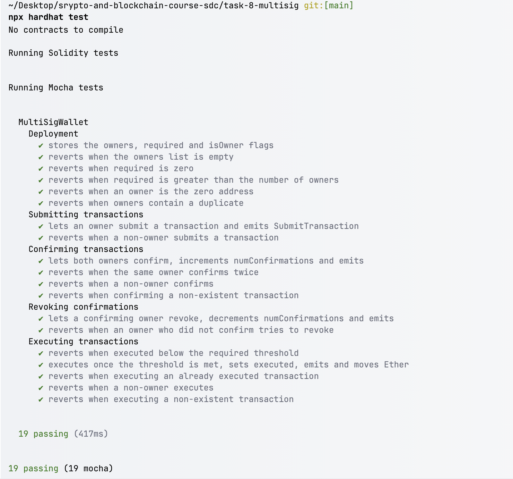
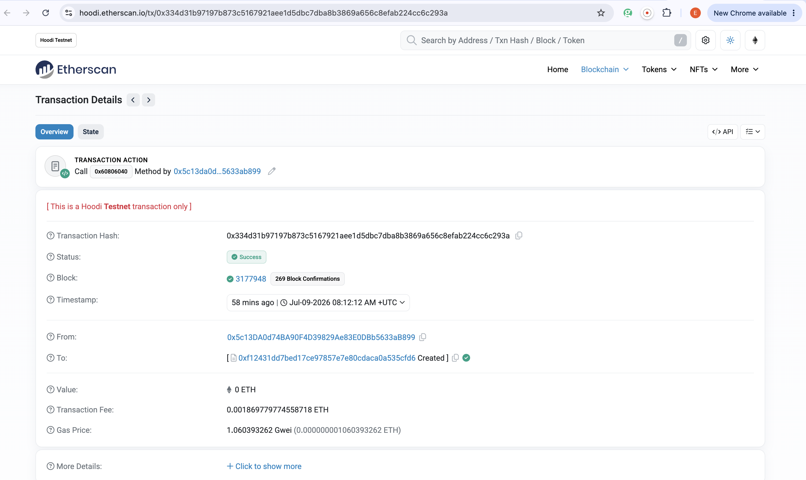
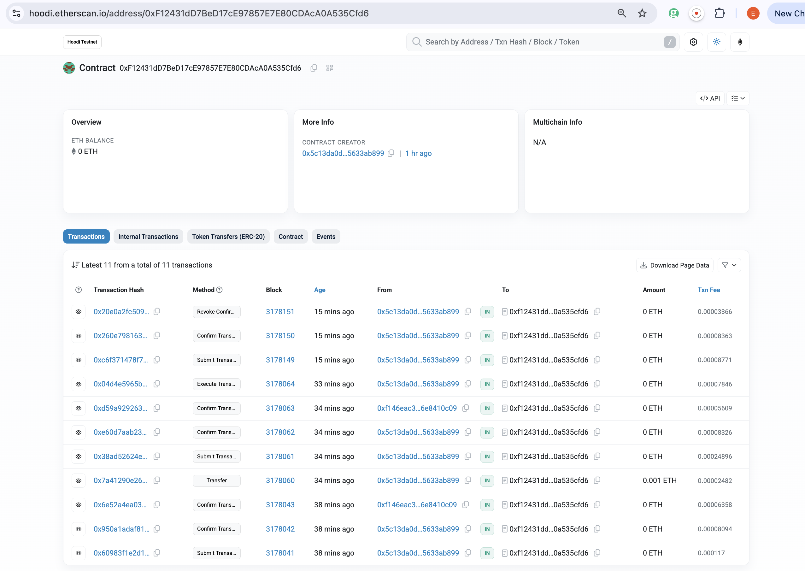
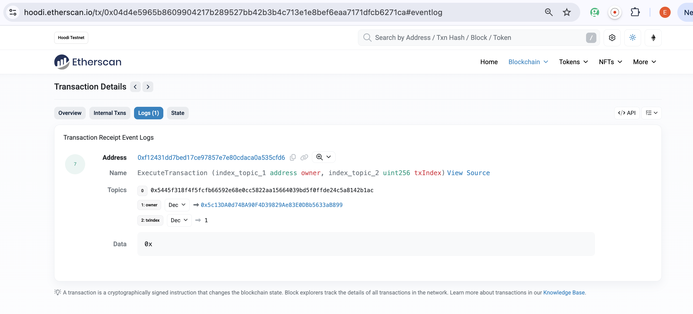
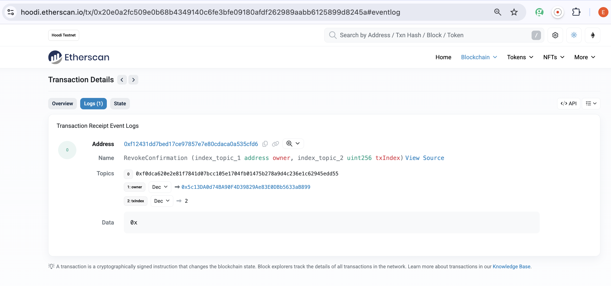

# MultiSigWallet — Task 8

A multi-signature wallet smart contract written in Solidity `^0.8.28`, tested with Hardhat 3 (Mocha + ethers), and deployed to the **Hoodi Testnet**.

## Overview

`MultiSigWallet` is an on-chain wallet that requires more than one owner to approve any outgoing transaction before it can be executed. Funds held by the contract can only move once a predefined number of owners (`required`) have independently confirmed a proposed transaction. The project contains the contract, a test suite, deployment and interaction scripts, and on-chain proof of execution.

## Purpose

The goal is to demonstrate a working M-of-N multi-signature scheme where no single owner can unilaterally spend funds. In this deployment the wallet is configured as **2-of-2**: both owners must confirm before a transfer executes. The project covers the full lifecycle (proposing, confirming, revoking, and executing transactions), verified both by unit tests and by real transactions on a public testnet.

Multi-sig removes the single point of failure of a single-key account: if one owner's key is lost or compromised, funds still cannot move without the remaining required approvals. This is why it is common for DAO treasuries and protocol governance. The threshold is a trade-off, since more confirmations mean more security but less convenience, so the right M-of-N depends on the value being protected.

## Contract Design

The contract stores owners and proposed transactions and tracks per-owner confirmations.

**State:**
- `address[] public owners`: the list of owner addresses.
- `mapping(address => bool) public isOwner`: fast owner lookup.
- `uint public required`: number of confirmations needed to execute a transaction.
- `Transaction[] public transactions`: all proposed transactions.
- `mapping(uint => mapping(address => bool)) public hasConfirmed`: which owner has confirmed which transaction.

**`Transaction` struct:**

| Field | Type | Meaning |
|---|---|---|
| `to` | `address` | recipient / call target |
| `value` | `uint` | amount of ETH to send |
| `data` | `bytes` | calldata for the target |
| `executed` | `bool` | whether it has been executed |
| `numConfirmations` | `uint` | current number of confirmations |

**Events:** `Deposit`, `SubmitTransaction`, `ConfirmTransaction`, `RevokeConfirmation`, `ExecuteTransaction`.

**Modifiers:** `onlyOwner`, `txExists`, `notExecuted`, `notConfirmed`.

## Multi-Signature Enforcement

The multi-sig rule is enforced at two points:

1. **Confirmation tracking:** each owner may confirm a transaction at most once (`notConfirmed` modifier + `hasConfirmed` mapping). Each confirmation increments `numConfirmations`.
2. **Execution threshold:** `executeTransaction` reverts with `"not enough confirmations"` unless `numConfirmations >= required`.

With `required = 2` and two owners, a transaction only executes when both owners have confirmed it. Any owner can withdraw their approval before execution via `revokeConfirmation`, which decrements the count.

## Core Functions

| Function | Access | Description |
|---|---|---|
| `constructor(address[] _owners, uint _required)` | — | Validates owners (non-empty, no zero address, no duplicates) and `required` (`1 <= required <= owners.length`). |
| `receive() external payable` | anyone | Accepts ETH deposits, emits `Deposit`. |
| `submitTransaction(address _to, uint _value, bytes _data)` | `onlyOwner` | Proposes a new transaction, emits `SubmitTransaction`. |
| `confirmTransaction(uint _txId)` | `onlyOwner` | Confirms a pending transaction (`txExists`, `notExecuted`, `notConfirmed`), emits `ConfirmTransaction`. |
| `executeTransaction(uint _txId)` | `onlyOwner` | Executes once `numConfirmations >= required`, emits `ExecuteTransaction`. |
| `revokeConfirmation(uint _txId)` | `onlyOwner` | Withdraws the caller's confirmation before execution, emits `RevokeConfirmation`. |
| `getOwners()` | view | Returns the owners array. |
| `getTransactionCount()` | view | Returns the number of proposed transactions. |

## Deployment

Deployment uses `scripts/deploy-multisig.ts`, which connects with `network.create("hoodi")`, reads two signer accounts, deploys `MultiSigWallet` with `owners = [Account 1, Account 2]` and `required = 2`, then waits for confirmations and prints the contract address, deploy transaction hash, and an Etherscan link.

```bash
npx hardhat run scripts/deploy-multisig.ts --network hoodi
```

**Deployed instance:**

| | |
|---|---|
| **Contract address** | `0xF12431dD7BeD17cE97857E7E80CDAcA0A535Cfd6` |
| **Deploy tx** | `0x334d31b97197b873c5167921aee1d5dbc7dba8b3869a656c8efab224cc6c293a` |
| **Owner 1 (Account 1)** | `0x5c13DA0d74BA90F4D39829Ae83E0DBb5633aB899` |
| **Owner 2 (Account 2)** | `0xF146EaC3eBa54e770a6e19AAF8553C66e8410c09` |
| **required** | `2` (both signatures mandatory) |

## Network

Deployed and exercised on the **Hoodi Testnet** (`chainId 560048`). The network is configured in `hardhat.config.ts` with two accounts (`HOODI_PRIVATE_KEY`, `HOODI_PRIVATE_KEY_2`) supplied through Hardhat's keystore, and an RPC URL via `HOODI_RPC_URL`.

## Interaction

Two scripts run the full wallet lifecycle against the deployed contract (`network.create("hoodi")` + `getContractAt`, no redeploy):

- **`scripts/interact-execute.ts`** funds the wallet through `receive()`, then runs submit → confirm (Owner 1) → confirm (Owner 2) → execute, performing a real **0.001 ETH** transfer to Owner 2. It prints every transaction hash and the recipient balance before and after execution (a +0.001 ETH delta around the execute call).
- **`scripts/interact-revoke.ts`** runs submit → confirm (Owner 1) → revoke (Owner 1), showing `numConfirmations` moving `0 → 1 → 0` and confirming `executed` stays `false`.

```bash
npx hardhat run scripts/interact-execute.ts --network hoodi
npx hardhat run scripts/interact-revoke.ts --network hoodi
```

## Testing

Run the suite locally on the in-memory `edr-simulated` network:

```bash
npx hardhat test
```

**Result: 19 passing (Mocha).** The suite uses two owners (`owner1`, `owner2`) with `required = 2`, plus a separate `nonOwner` for access-control checks, and connects to ethers via `network.create()`.

## Covered Cases

Grouped by `describe` block in `test/MultiSigWallet.ts`:

- **Deployment:** stores owners / `required` / `isOwner`; reverts on empty owners, `required = 0`, `required > owners.length`, zero-address owner, and duplicate owners.
- **Submitting transactions:** owner can submit (emits `SubmitTransaction`); non-owner submit reverts.
- **Confirming transactions:** both owners confirm and `numConfirmations` increments; double-confirm reverts; non-owner confirm reverts; confirming a non-existent `txId` reverts.
- **Revoking confirmations:** a confirming owner can revoke (count decrements, event emitted); revoking without a prior confirmation reverts.
- **Executing transactions:** reverts below threshold; executes at threshold (sets `executed`, emits `ExecuteTransaction`, moves ETH to the recipient); re-executing an executed transaction reverts; non-owner execute reverts; executing a non-existent `txId` reverts.

## Security Considerations

The following protections are implemented directly in `contracts/MultiSigWallet.sol`:

- **Checks-Effects-Interactions in `executeTransaction`:** the `executed` flag is set to `true` before the external `call`, so state is updated before any outbound interaction.
- **Reentrancy protection:** because `executed` is set first and the `notExecuted` modifier guards entry, a reentrant call back into `executeTransaction` for the same `txId` fails the `notExecuted` check, so funds cannot be drained by repeated execution.
- **Constructor validation:** rejects an empty owners list, any zero-address owner, duplicate owners, and any `required` outside `[1, owners.length]`.
- **Access control:** all sensitive functions (`submitTransaction`, `confirmTransaction`, `executeTransaction`, `revokeConfirmation`) are gated by `onlyOwner`.
- **Confirmation integrity:** `notConfirmed` + `hasConfirmed` prevent an owner from inflating the count by confirming the same transaction multiple times.

## Potential Vulnerabilities

- **Failed external call reverts the whole execution:** if the target `call` returns `false`, `executeTransaction` reverts with `"transaction execution failed"` and the transaction stays unexecuted. This is the intended safety behavior, but it means a badly chosen target can leave a transaction stuck until conditions change (for example, once the wallet is funded).
- **Fixed owner set:** with no add/remove-owner logic, a lost owner key cannot be rotated out; the owner configuration is permanent for the life of the deployment.
- **Trust in owners:** the scheme assumes owners are independent parties. If `required` owners collude (here, both), they can move funds. This is inherent to any M-of-N multi-sig and not a contract flaw.

## Proof of Execution

### 1. Test suite — 19 passing


### 2. Contract deployment


Etherscan: https://hoodi.etherscan.io/tx/0x334d31b97197b873c5167921aee1d5dbc7dba8b3869a656c8efab224cc6c293a

### 3. Full transaction history on Hoodi Etherscan


Etherscan: https://hoodi.etherscan.io/address/0xF12431dD7BeD17cE97857E7E80CDAcA0A535Cfd6

> **Note:** `txId 0` (the three earliest rows) was submitted and confirmed by both owners before the wallet held any ETH, so its `executeTransaction` reverted and it stayed unexecuted. This is a live example of the "stuck until the wallet is funded" behavior noted under [Potential Vulnerabilities](#potential-vulnerabilities). The wallet was then funded (the `0.001 ETH` Transfer) and `txId 1` was submitted, confirmed by both owners, and executed successfully.

### 4. ExecuteTransaction event (txIndex 1, real 0.001 ETH transfer)


Etherscan: https://hoodi.etherscan.io/tx/0x04d4e5965b8609904217b289527bb42b3b4c713e1e8bef6eaa7171dfcb6271ca#eventlog

### 5. RevokeConfirmation event (txIndex 2)


Etherscan: https://hoodi.etherscan.io/tx/0x20e0a2fc509e0b68b4349140c6fe3bfe09180afdf262989aabb6125899d8245a#eventlog

## Project Structure

```
task-8-multisig/
├── contracts/
│   └── MultiSigWallet.sol        # the multi-signature wallet contract
├── scripts/
│   ├── deploy-multisig.ts        # deploy to Hoodi (owners + required = 2)
│   ├── interact-execute.ts       # submit → confirm x2 → execute (0.001 ETH)
│   └── interact-revoke.ts        # submit → confirm → revoke
├── test/
│   └── MultiSigWallet.ts         # 19 passing tests
├── screenshots/                  # on-chain proof of execution
│   ├── 01-tests.png
│   ├── 02-deploy-tx.png
│   ├── 03-transactions-list.png
│   ├── 04-execute-logs.png
│   └── 05-revoke-logs.png
├── hardhat.config.ts             # Hardhat 3 config (Hoodi network, chainId 560048)
├── tsconfig.json
├── package.json
└── package-lock.json
```

## Conclusion

`MultiSigWallet` is a working 2-of-2 multi-signature wallet with a full propose → confirm → execute flow and confirmation revocation, following the checks-effects-interactions pattern and owner-only access control. It is verified by 19 passing unit tests and a real 0.001 ETH transfer on the Hoodi Testnet that required both owners' confirmations.
