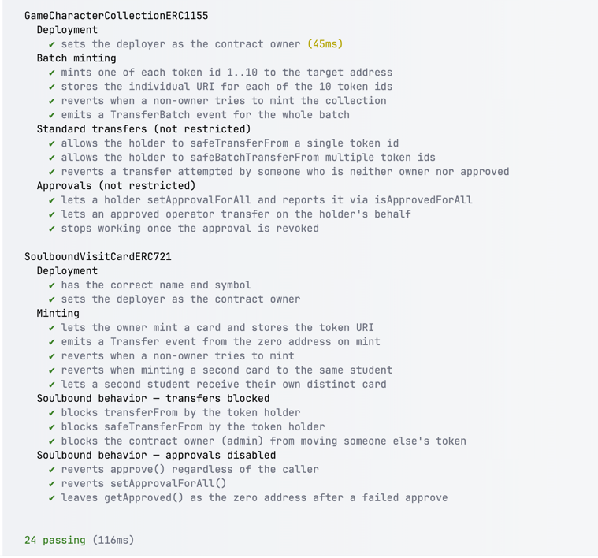
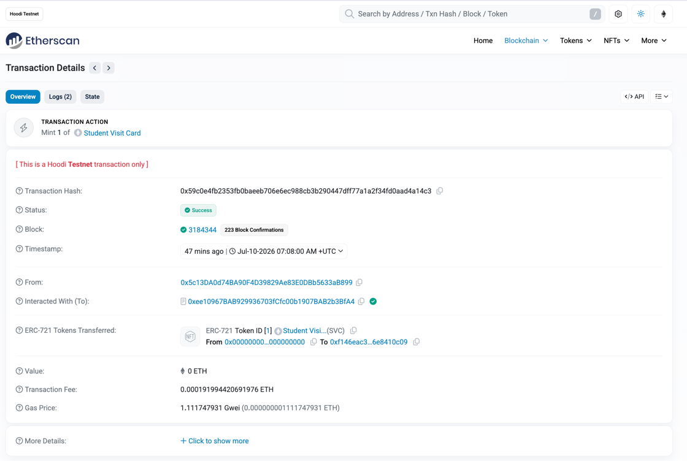
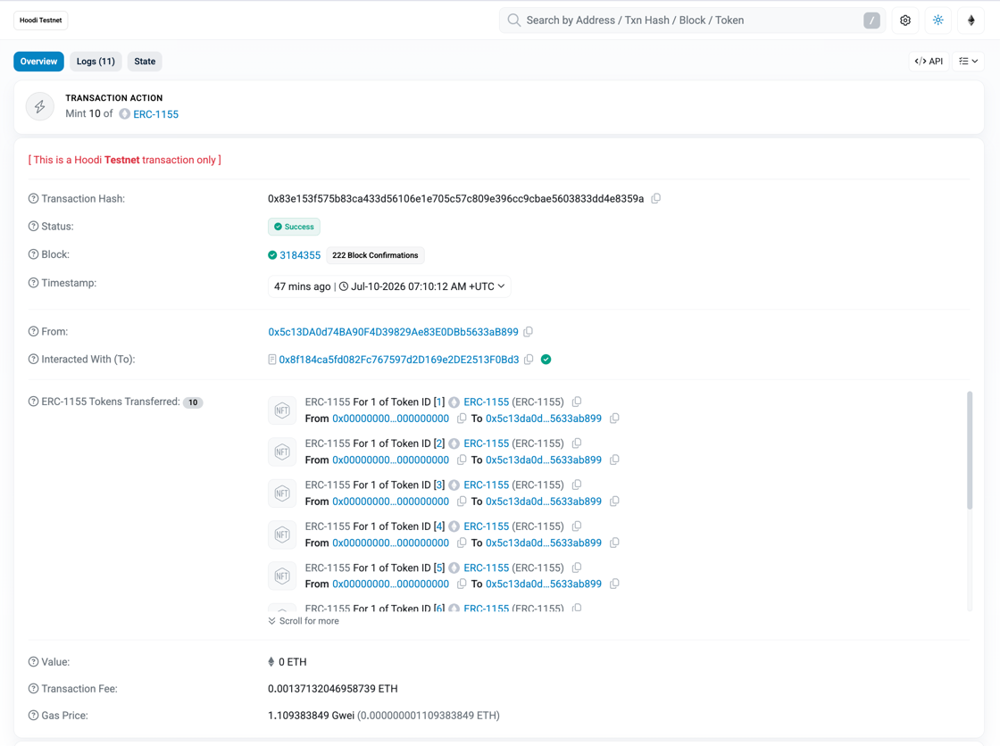
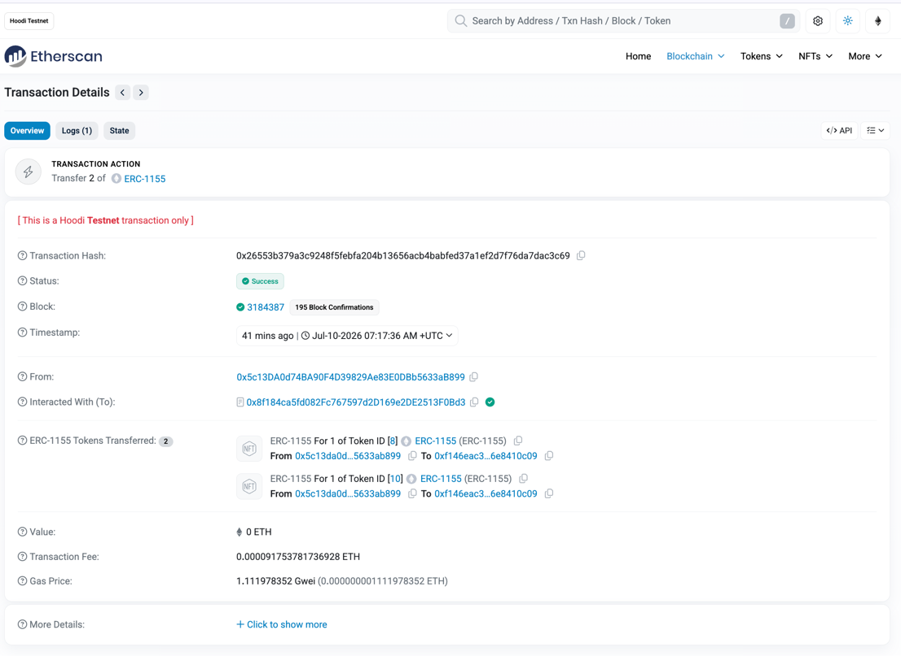
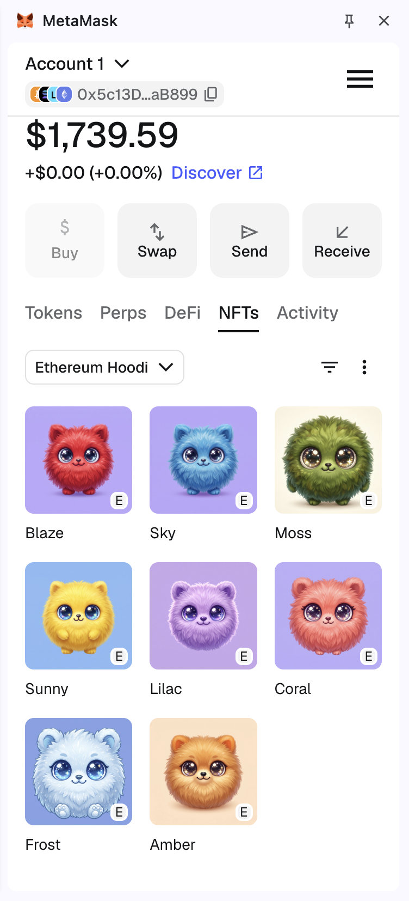
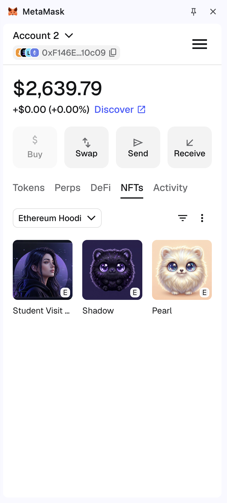

# Task 9: NFT (Soulbound ERC-721 + ERC-1155 collection)

## Overview

Two independent contracts in one project:

- `SoulboundVisitCardERC721`: a non-transferable student visit card.
- `GameCharacterCollectionERC1155`: a collection of 10 game characters.

Both live in `contracts/`, each in its own file. The task asked for the two
contracts to be separate, not for separate repositories, so they share a single
Hardhat project.

## Contracts

### SoulboundVisitCardERC721

- Built on OpenZeppelin `ERC721` + `ERC721URIStorage` + `Ownable` (OZ v5.x).
- `mint(to, uri)`: owner only. One token per address, enforced with a
  `balanceOf(to) == 0` check.
- Soulbound behavior is implemented by overriding `_update`, the current hook in
  OZ v5 that replaces the removed `_beforeTokenTransfer`. Only mint (`from == 0`)
  and burn (`to == 0`) are allowed. Any other transfer reverts with
  `"Soulbound: transfers are disabled"`.
- `approve()` and `setApprovalForAll()` always revert with
  `"Soulbound: approvals are disabled"`.

### GameCharacterCollectionERC1155

- Built on OpenZeppelin `ERC1155` + `ERC1155URIStorage` + `Ownable` (OZ v5.x).
- Token ids 1 to 10. Each id has its own URI, set individually through
  `_setURI(tokenId, uri)` instead of the shared `{id}` template.
- `mintCollection(to, uris)`: owner only. Mints one of each id in a single
  `_mintBatch` call and stores each id's URI.
- Transfers and approvals are not restricted. `safeTransferFrom`,
  `safeBatchTransferFrom`, and `setApprovalForAll` behave as standard ERC-1155.

## Metadata & Storage

Images and JSON metadata are stored on IPFS (uploaded through Pinata). The JSON
follows the common NFT metadata format (OpenSea compatible): `name`,
`description`, `image` (`ipfs://...`), and `attributes`.

The soulbound card has two attributes: `studentName` and `course`. Each
character has four: `color`, `speed`, `strength`, `rarity`.

Visit card (`metadata/0.json`):

```json
{
  "name": "Student Visit Card — Evgeniya Y.",
  "description": "Soulbound visit card NFT for the Crypto and Blockchain course.",
  "image": "ipfs://bafybeigcfyhszknchfztk2gd7eqsuck4rbmyygwwuyvgtjbmr7z62o5lbu",
  "attributes": [
    { "trait_type": "studentName", "value": "Evgeniya Y." },
    { "trait_type": "course", "value": "crypto-and-blockchain-course-sdc" }
  ]
}
```

Character example, Blaze (`metadata/1.json`):

```json
{
  "name": "Blaze",
  "description": "A fluffy fur ball creature character.",
  "image": "ipfs://bafybeihepqhv2jyvxya4axequjojmprgasglypql5agqc7ecgd3a4des34",
  "attributes": [
    { "trait_type": "color", "value": "red" },
    { "trait_type": "speed", "value": "High" },
    { "trait_type": "strength", "value": "Medium" },
    { "trait_type": "rarity", "value": "Rare" }
  ]
}
```

## Deployment

Network: Hoodi Testnet (chainId 560048). The RPC URL and both private keys are
read from the Hardhat keystore (`HOODI_RPC_URL`, `HOODI_PRIVATE_KEY`,
`HOODI_PRIVATE_KEY_2`).

Deployment and minting are split into separate scripts in `scripts/`. Deployed
addresses are written to `deployed-addresses.json`, and the mint/transfer
scripts read the addresses back from that file.

Run each script with:

```bash
npx hardhat run scripts/<file> --network hoodi
```

Order used:

1. `deploy-soulbound.ts`
2. `mint-soulbound.ts`
3. `deploy-collection.ts`
4. `mint-collection.ts`
5. `transfer-to-student.ts`

Deployed addresses:

- `SoulboundVisitCardERC721`: `0xee10967BAB929936703fCfc00b1907BAB2b3BfA4`
- `GameCharacterCollectionERC1155`: `0x8f184ca5fd082Fc767597d2D169e2DE2513F0Bd3`

## Minting

What was done on Hoodi:

- The soulbound card (tokenId 1) was minted to the student wallet (Account 2,
  `0xF146EaC3eBa54e770a6e19AAF8553C66e8410c09`).
  Tx: `0x59c0e4fb2353fb0baeeb706e6ec988cb3b290447dff77a1a2f34fd0aad4a14c3`
- All 10 characters (ids 1 to 10, one each) were batch minted to the owner
  (Account 1, `0x5c13DA0d74BA90F4D39829Ae83E0DBb5633aB899`).
  Tx: `0x83e153f575b83ca433d56106e1e705c57c809e396cc9cbae5603833dd4e8359a`
- Shadow (id 8) and Pearl (id 10) were moved from Account 1 to Account 2 in a
  single batch transfer.
  Tx: `0x26553b379a3c9248f5febfa204b13656acb4babfed37a1ef2d7f76da7dac3c69`

## Testing

```bash
npx hardhat test
```

Result: 24 passing (13 for `SoulboundVisitCardERC721`, 11 for
`GameCharacterCollectionERC1155`).

Covered:

- `SoulboundVisitCardERC721`: deployment (name, symbol, owner); minting and
  access control (owner mints, non-owner reverts, one card per address, second
  student gets a distinct token); soulbound transfer blocking (`transferFrom`,
  `safeTransferFrom`, and the contract owner all revert); soulbound approval
  blocking (`approve`, `setApprovalForAll`, and `getApproved` stays zero).
- `GameCharacterCollectionERC1155`: deployment (owner); batch minting (all 10
  ids minted, per-id URIs stored, non-owner reverts, `TransferBatch` emitted);
  standard transfers (`safeTransferFrom`, `safeBatchTransferFrom`, and a revert
  when the caller is neither owner nor approved); approvals (`setApprovalForAll`
  with `isApprovedForAll`, operator transfer, and revert after revoking).

## Proof of Execution


*Test suite: 24 passing.*


*Minting the soulbound visit card. [View on Etherscan](https://hoodi.etherscan.io/tx/0x59c0e4fb2353fb0baeeb706e6ec988cb3b290447dff77a1a2f34fd0aad4a14c3)*


*Batch minting all 10 game characters. [View on Etherscan](https://hoodi.etherscan.io/tx/0x83e153f575b83ca433d56106e1e705c57c809e396cc9cbae5603833dd4e8359a)*


*Batch transfer of two characters to the student wallet. [View on Etherscan](https://hoodi.etherscan.io/tx/0x26553b379a3c9248f5febfa204b13656acb4babfed37a1ef2d7f76da7dac3c69)*


*Owner wallet after transfer: 8 remaining characters.*


*Student wallet: visit card plus the two transferred characters.*

## Project Structure

```
task-9-nft/
├── contracts/
│   ├── SoulboundVisitCardERC721.sol
│   └── GameCharacterCollectionERC1155.sol
├── scripts/
│   ├── config.ts                  # addresses, URIs, deployed-address helpers
│   ├── deploy-soulbound.ts
│   ├── mint-soulbound.ts
│   ├── deploy-collection.ts
│   ├── mint-collection.ts
│   └── transfer-to-student.ts
├── test/
│   ├── SoulboundVisitCardERC721.ts
│   └── GameCharacterCollectionERC1155.ts
├── metadata/
│   ├── 0.json                     # soulbound visit card
│   └── 1.json ... 10.json         # game characters
├── screenshots/
├── deployed-addresses.json
├── hardhat.config.ts
├── tsconfig.json
├── package.json
└── package-lock.json
```
